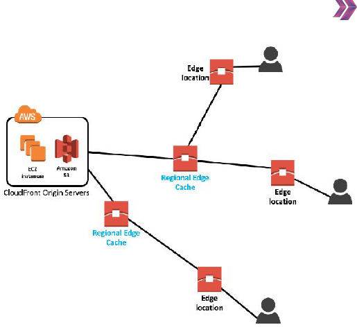

# **CLOUDFRONT(Content Delivery Network)**
# *What Is Cloudfront*
- Farklı geographcal places'lerde bulunan küresel olarak dağıtılmış network (bağlantı noktaları)
- Bu servisin amacı; statik ve dnamik web içeriğini end user(kullanıcılara) daha hızlı şekilde ulaştırmak
- Edge Locaiton(veri merkezleri) cloudfront'un backbone'unu oluşturur
- 

# *Cloudfront Infrastructure*
- AWS Cloudfront dünya genelinde 550+ Points of Presence (PoP) sahip
-     Bunların 500+ Edge Location 
-              13 Regional Edge Caches
- Regional Edge Caches, Edge Location'lardan büyük 
- Edge Location ve Regional Edge Caches'ler birbirine mutlak bağlı
- 

# *How Does Cloudfront Work*
- User'ların origin server'a ulaşmadan önce edge location'a ulaşması..bu şekilde origin server'ın yükü azalır ve user'ın alacağı mesafe azalır (**Elastic Caches**)
- User herhangi bir web sitesine ulaşmak istediğinde (example.com) origin server'da bulunan Sî ec2 vb servisine ulaşır. Bu aşamada edge location olmadan oluşturulan request'e verilecek responce süresi uzar mesafeden dolayı. Edge location olduğu zaman user'ın request'i önce edge location'a gelir ve response süresi azalır
- CloudFront'un dünya çapındaki dağıtılmış edge location'ları, istenen verileri önbelleğe alır ve kullanıcılar ile sunucular arasında gidip gelme zorunluluğu olmadan son kullanıcılara sunar.

# *Origins*
- Aws Origins; aws tarafından oluşturulan 
-      elastic load balancer 
-      mediastore container; medya içeriklerini saklayıp dağıtır
-      mediapackage container; farklı platformlara dağıtmak
-      API Gateway
-      S3 Bucket; objelere direkt erişşim apı üzerinden yani bağlantı https üzerinden olur.
-      S3 Bucket'ın static website özelliği açılırsa custom origins olur 
- Custom Origins;
- OAC,OAI çeşitli kısıtlamalar aslında. S3'e kimler ulaşabilir
- CDN, bir web sitesinin içeriğini en düşük ağ ve işlem gecikmesi ile yani en hızlı bir şekilde kullanıcılara ulaştırmak üzere coğrafi olarak farklı bölgelerde konumlandırılmış sunucu kümesine verilen isimdir.

# *Signed URLs & Signed Cookies*
- Çerez(cookies) ayarları 
- Cookies belli başlı ayarları hafızada tutar
