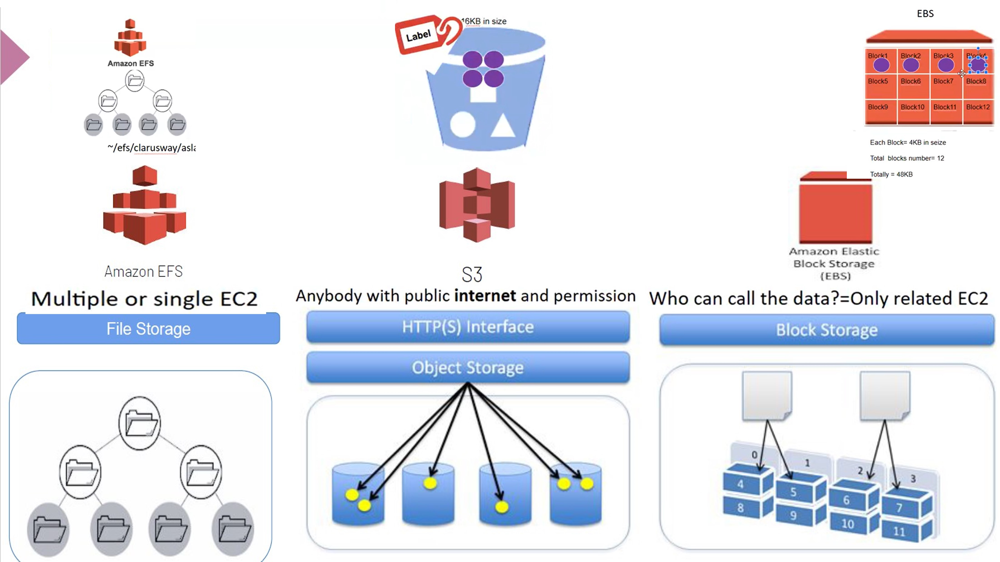
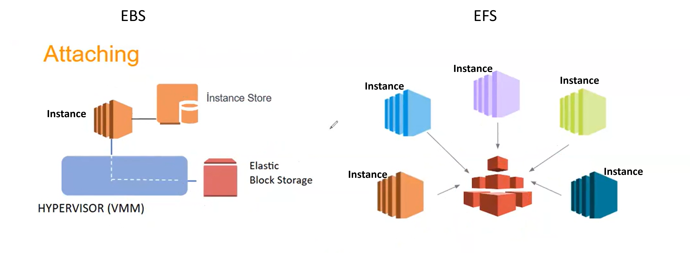
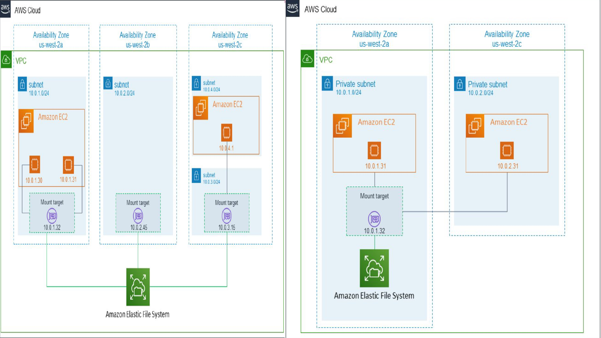
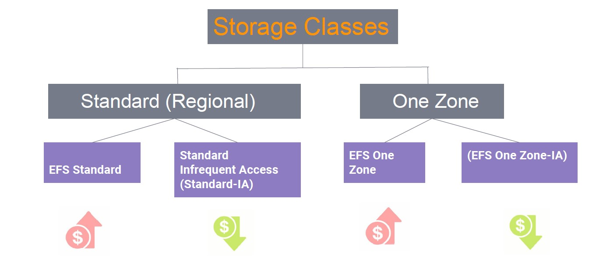
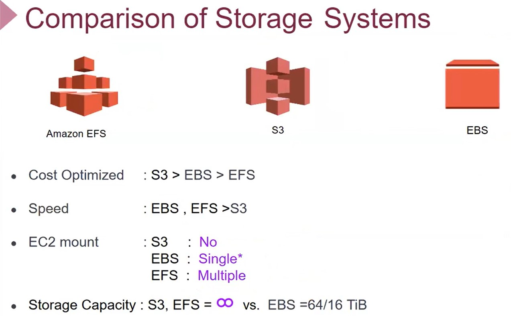
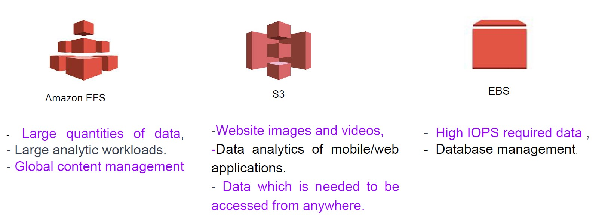

# ELASTIC FILE SYSTEM ===> (00:16:00)

- Simple, scalable, fully managed >> Elastic Network File System (NFS)

- Storage Area Network (SAN) - Block Device DAS (Direct attached storage) (Instance store) >> TEK instance a bağlı database (EBS), tüm işlemi bağlı instance-PC yapar. (genellikle pc ye ait sistem dosyaları var)
- Network Attached Storage >> NFS server kurulu, bu server tek işi kendine bağlanan client lara veriyi aktarmak. (bir client bir dosyada değişiklik yaptığında tüm clientlardaki o dosya güncellenir)

- EFS >> minumum ücret veya kurulum ücreti yok. Sadece LINUX işletim sisteminde çalışır !!!

- MOUNT TARGET : ===> (00:36:00)

- Mount Target >> AZ BASED component
  - Standart (Regional) Storage Class : Her AZ için bir tane MOUNT Target kurulur. Az in içerisindeki bütün resource lar bu MOUNT TARGETı kullanır.
  - One-zone Storage Class : Kendimizin seçtiği bir AZ içerisine MOUNT Target kurup aynı region daki AZ ler bu MP kullanır. Diğer classa göre gecikme (latency) yaşanabilir.

- S3-EBS-EFS KARŞILAŞTIRMA ===> (00:40:50) (geniş bilgi ===> https://tutorialsdojo.com/)amazon-s3-vs-ebs-vs-efs/

Kabaca kullanım şekli > .txt dosyan var. Tek bir dosyanı saklamak istiyorsan (tek bağlantı) > EBS
(kesin bir çizgi yok) Birden fazla instance ulaşılsın istiyorsan > EFS
İnternet üzerinden ulaşılsın istiyorsan > S3

# HANDS-ON ===> (01:11:45)

- Hazırlık için:

  - AWS> EC2> Network & Security> Security Groups > Create Security Group :
    - Default VPC'de SADECE SSH (port:22) açık olan SG oluştur.(name: only-ssh)
    - EFS için >>> Default VPC > NFS (port:2049) açık olsun. Source kısmına only-ssh (az önce oluşturduğumuz, instanceların SG olacak olan Security Group) yazıp >> çift katmanlı sistem

  - AWS> EC2> Instances > Instances :
    - Name : Yasin- /AMI: AWS Linux 2023 / Key pair seç / VPC : Default
    - SG: only-ssh (az önce oluşturduğumuz)
    - Number of instances: 2 >>>> LAUNCH INSTANCES
    - Instancelar oluşunca isimlerini Yasin-1 ve Yasin-2 olarak değiştir.
    - Terminalde 2 farklı BASH aç. 2 farklı instance a bağlan.
    - İki farklı INSTANCE ayırmak için:
      - export PS1="\[\e[31;42m\]\u@\h:\w\$\[\e[0m\]" >>> renklendir. (sayıları değiştirerek rengi değiştir)
      - sudo hostnamectl set-hostname First / bash + sudo hostnamectl set-hostname Second / bash ile hostname DEĞİŞTİR.

  - AWS> EFS > Create File System : Çıkan ekranda NAME verip VPC seçersek herşey otomatik oluşur. Ancak içeriğe hakim olabilmek için >> CUSTOMIZE
    - STEP 1: (file system settings)
      - Name ver
      - Storage class : Standard (regional-multiple AZ) ve one zone (tek AZ) >> Standart SEÇ
      - Enable automatic backup >> HAYIR
      - Transition into IA >>> NONE yap. (eriişim az olduğunda storage class-standart IA ye geçiş yapmak)
      - Encryption of data rest >>> dosya saklanırken şifreleme EVET
      - Throughput mode: enhanced / Elastic
      - Tag > OPTIONAL >>> NEXT
    - STEP 2: (network access)
      - Security Groups >> tamamı default seçili, HEPSİNİ kaldır, az önce oluşturduğumuz EFS-SG seç
      - > > > > NEXT
    - STEP 3: (file system policy) >> birşey seçmeden NEXT
    - STEP 4: (review and create ) >> CREATE

- Uygulama ===> (02:09:00)

  - AWS> EFS > Az önce oluşturduğumuz EFS > ATTACH > Mount via DNS > Komutlar (mavi renkliler oluşturduğumuz EFS nin IDsi) KOMUT1

  - Terminalde First ve Second instance'a
    - sudo yum install -y amazon-efs-utils YÜKLE
    - sudo mkdir efs >>> klasör oluştur.
    - KOMUT1'i çalıştır (sudo mount -t efs -o tls fs-xxxxxx:/ efs) > MOUNT lama işlemini yap
    - cd efs ile EFS klasörüne gir.

  - First instance'dan:
    - sudo nano example.txt >>> hello from first EC2 >> CTRL X+Y ile çık.

  - Second instance'da dosyayı ve yazıyı GÖR. >>> cat example.txt
    - sudo nano example.txt >>> hello from second EC2 >>> CTRL X+Y ile çık.
    - First instance'da yazıyı GÖR. >>> cat example.txt

  - df -h >> komutu ile home/ec2-user/efs >> Mount edildiğini GÖR
  - Second instances da >>> sudo reboot YAP (tekrar bağlanmak uzun sürebilir) >> tekrar bağlan.
  - REBOOT sonrası HATA alırsan ssh-keygen -R [hostname] KOMUTU çalıştır.
  - df -h >> komutu ile EFS GÖREMEDİĞİNİ teyit et. efs klasörü VAR/example.txt YOK, ancak mount işi YOK
  - (HOME klasöründe) KOMUT1'i çalıştır (sudo mount -t efs -o tls fs-xxxxxx:/ efs) > MOUNT lama işlemini yap

  - REBOOT ettikten sonra OTOMATİK BAĞLANMAK İÇİN; ===> (02:32:45)
    - AWS> EC2> Instances > Instances :
    - Name : Yasin-3 /AMI: AWS Linux 2023 / Key pair seç / VPC : Default
    - SG: only-ssh (az önce oluşturduğumuz)
    - Storage (volumes) >> EDIT
      - EFS seçmen için SUBNET seçmen lazım > Herhangi bir default SUBNET seç.
      - EFS >> Add shared file system > oluşturduğumuz EFS seç, mount point seç(default kalabilir)
      - Automatic create and attach security groups >> TİKİ KALDIR (istemiyoruz)
      - Automatically mount shared file system by ..... >> Check (istiyoruz)
        > > > > LAUNCH INSTANCES

  - Terminalde 2'yi kapat şimdi oluşturduğumuz INSTANCE a bağlan (Status check > 2/2 checks passed OLANA KADAR BEKLE!!!!! ÖNEMLİ)

    -   sudo hostnamectl set-hostname Third / bash  >>> hostname değiştir
    -   df -h >> komutu ile home/ec2-user/efs >> Mount edildiğini GÖR
    -   cd /mnt/efs/fs1/ ve cat example.txt  >> dosyları görebildiğini TEYİT ET
    -   sudo nano example.txt >>> "hello from third EC2" >>> CTRL X+Y
    -   First instance'da yazıyı GÖR. >>> cat example.txt
  
  - FIRST INSTANCE a REBOOT tan sonra otomatik bağlansın istiyorsak: (MOUNT edilen kısmın REBOOT sonrası kaybolmaması için)
    -  /etc/fstab ==> dosyası içerisinde MOUNT edilen volumeler kayıtlıdır. bundan dolayı bu dosyaya yazılması gerekmektedir.
    -   sudo cp /etc/fstab /etc/fstab.bak ==> komutu ile fstab dosyasının backupunu oluştur.
    -   sudo nano /etc/fstab ==> komutu ile aşağıdaki metni yazdır.
        fs-xxxxxx:/ /home/ec2-user/efs efs tls,_netdev  >> xxxxxx EFSmizin IDsi

#   INSTANCE ları TERMINATE et, EFS yi DELETE              
