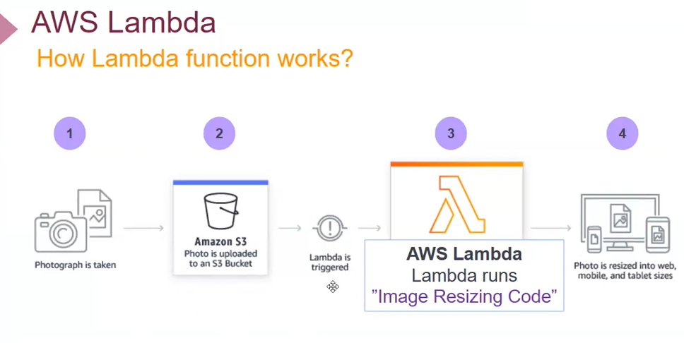

# LAMBDA
- Serverless olmasının sebebi; birçok servisi kendisi ayağa kaldırıyor..kullanıcısı bir mimari kurma 
- Lambda, dynamodb, apı gateway, SQS, s3 gibi servisler serverless
- serves çalışıyor aslında ama biz çalıştırmıyoruz 
- lambda FaaS olarak kullanılan ilk servis
- Biz ec2 kaldırmak yerine kodu verip çalışmasını bekliyoruz 
- Lambda nasıl çalışır; 
-       anlık foo aldın ve S3 bucket'a gitti, lamnda yüklenen datayı resize yapar (bunun için lambda kodu yazılır) ve resize edilem data web sitesinde yayınlanır
- Lambda Java, Go, Powersell, Node, Ruby ve python dillerinde destklenir
- Lambda API gateway olmadan çaışmaz, bir url çağırma işini API gateway sağlar 
- Lambda birçok servisle birlikte çalışabilir
- Çalıştırdığın kadar öde (exactly pay as you go)
- Request'ed göre Otomatik olarak scale oluşturur
-     autoscaling, capacity, monitoring ve loglama işlemlerini aws yürütür

- Mormalde lambda apı agteway olmadan çalışmaz çünkü apı gateway url sağlayıcıdır
- Aws güncelleme getirerek;
-       advance settings > enable function URL ayarı ile apı gateway olmadan da URL sağlamayı hedeflemiş
- Buna rağmen API gateway'in farklı artıları da mevcut 
- AWS CONSOL'DA;
-     permission kısmına dikkat 
-     CODE SOURCE; lambda function'a kodu ekle, DEPLOY et ve son aşamada TEST yap
-     TEST yaptıktan sonra pencere açılır. Yazdığın fonksiyon dışardan input alırsa EVENT JSON kısmına key, value eklenir. Yazdığın fonksiyon kendi içindeki inputtan çıktı alıyorsa EVENT JSON kısmını değiştirmeye gerek yok

- BUCKET OLUŞTURURKEN;
- 2 bucket oluşturuldu. Biri source biri destination..Bucket'a obje atıldığında lambda tetiklenir ve destination'a kopyalar 

# API GATEWAY
- Amazon API Gateway, yazılım geliştiriciler tarafından istenen ölçekte API yayımlanmasını, API’lerin izlenmesini, bakımının yapılmasını, güvenliğinin sağlanmasını ve çalıştırılmasını mümkün kılan, tam olarak yönetilen bir hizmettir. API’leri uygun ölçekte güvenli ve güvenilir bir şekilde çalıştırmak için gereken tüm kaçınılmaz ağır yüklerin üstesinden gelen bir kullandıkça öde hizmetidir.
- API Gateway ile hızla ve kolayca AWS Lambda’da çalışan kodunuza yönelik özel API’ler oluşturabilir ve Lambda kodunu API’nizden çağırabilirsiniz. API Gateway, hesabınızda AWS Lambda kodu yürütebilir, AWS Step Functions durum makineleri başlatabilir ya da AWS Elastic Beanstalk, Amazon EC2 veya genel erişime açık HTTP uç noktaları olan AWS dışındaki web hizmetlerine çağrı yapabilir.

- 2 tür API var; Websocket APIs ve Restful APIs
- websocket dynamic (chat gibi oyunlarda vs kullanılır) 
- 