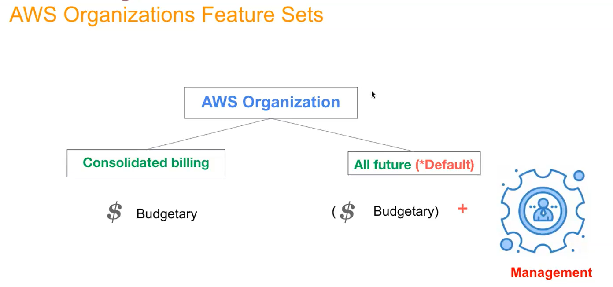

# AWS ORGANIZATION
- Bir şirkette farklı departmanlara farklı aws account'ları vererek gruplandırma 
- Yetki alanını sınırlama da olabilir
- Mesela deploy ve test için kullanılaan aws account'ların ayrılması
- Bir hesap üzerinden gruplarla yönetmek yerine farklı account'lar ile yönetmek 
- IAM rollerde gruplar oluşturmuştuk (santral telefon rehberi analojisi)..burada tek account üzerinden gruplara (departmanlara ayırmıştık)
- Organization'da amaç bunu farklı accountlar üzerinden sağlamak 
- Organization; 
-     fiyatlandırma, güvenlik ve ortak hareket edebilme anlamınnda tüm ekibi yönetebilme 

# Features of AWs Organization
- Tek bir merkezden Aws accounts'ları yönetebilme (centralized management of all aws accounts)
- Consolidated billing;
- bütçeyi karşılamak için hiyerarşi olarak bir gruplandırma sağlayabilir (hierarchical grouping of your accounts to meet your budgetary)
- policies'lerin merkezden kontrolü 
- IAM ve IAM Identitiy Center (SSO); User'lara IAM üzeirnden değil de belirlenen emailler üzerinden izin verme 

    

- Consolidated billing; amaç budgetary yönetmek (bütçeyi yönetmek)
- All future (default); hem budgetary (bütçeyi ortak faturada) yönetmek hem de management (yönetimsel, çeşitli kurallar(policies) belirleyebilirsin accountlar için)
- Budgetary (Fiyatlandırma); toptan satış analojisi
-     Farklı 2 account için ayrıca para ödemek yerine 2 account çin aws organization kullanarak avantaj fiyatlandırmadan faydalanma
-     Mesela 2 account için 8 ve 7 toplam 15 $ ödemek yerine aws organization kullanarak 10$ üzerindeli fiyat için indirim kazanmak 
#     **SINAVLARDA SORULABİLİR**

# Supported Policy Types 
- AI services opt-out policies 
- Backup policies 
- Service Control Policies 
-     servsi bazlı kural belirleme, mesela ec2 için sadece belli ımage kullan vb
-     kriptosuz hiçbir şeyi s3 bucket'a atma gibi sınırlayıcı, engelleyici kurallar belirlenebilir
-     aws servisleri özelinde policies belirleme
- Tag Policies 
-     Devops'da yoğun kullanılacak, taglara göre gruplama, policies belirleme

# IAM Identity Center (SSO)
- Tek bir yerden giriş
- 