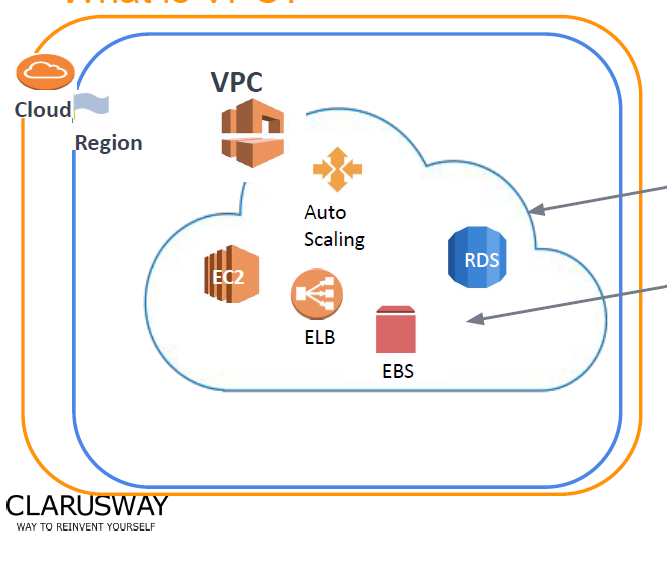
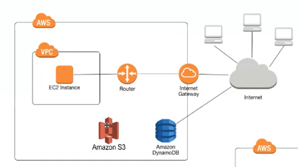
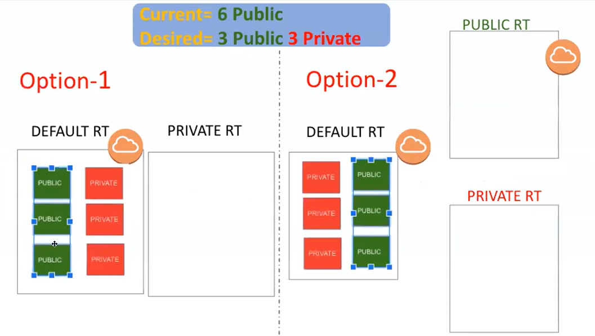

# **VPC(Virtual Private Cloud)**
# *What Is VPC*

- Cloud'un içinde İzole edilmiş alan

- Cloud sisteminde ulaştığımız veya yapılandırdığımız bir fiziksel ağ (pyhsical network) yok, aws'de buna VPC denir 

- Aws içindeki resource'ları güvenli alanda tuttuğumuz yer VPC'dir

# *VPC COMPONENTS*

- Aws servislerinden S3 ve Amazon DynamoDB VPC içerisinde değildir

- Ec2 vb servisler S3, DynamoDB gibi servislerle iletişim kurmak için önce internet ile bağlantılı kurmalıdır

- Buna alternatif olarak EC2 gibi servisler VPC Endpoint oluşturarak internetle bağlantı kurmadan da S3, DynamoDB servisleri ile iletişim kurabilir

- Aws üzerine oluşturduğunuz her proje için bir veya birden fazla VPC kullanılır (izole alandır)

- Vpc region'a göre oluşturulur Bununla birlikte her VPC içinde farklı Availabilitiy Zone'lar bulunur.

- Vpc oluştururken kriter region'dır, Subnet oluştururken ise bulunduğu VPC ile birlikte AZ'a göre belirlenir

# *VPC CIDR*
- CIDR; classes ınter domain routing 
- Internet Protocol (ıp) demeti
- CIDR private ip demeti gibi düşünülebilir. Bu private ip'leri vpc ile birleştirip subnetleri oluşturulur. Burdan seçilen ip'ler oluşturulan ınstance'lara yönlendirilir (eşleştirilir vs)
-                              VPC      10.7.0.0/16 = 65 BİN IPs üretilebilir
-                               Subnet   1a subneti 10.7.1.0/24 = 256 IPs üretilir.. Resource 1 = 10.7.1.4/32
-                                                                                    Resource 2 = 10.7.1.5/32
-                                                                                          .
-                                                                                           .
-                                                                                           .
-                                                                                   Resource 251 
-                                       **5 TANE IP ADRESİ REZERVE BU YÜZDEN KULLANILMAZ, IP'LER 4TEN BAŞLAR**
                                                                                     
-                                        1b subneti 10.7.2.0/24 = 256 IPs üretilir..
-                                        1c subneti 10.7.3.0/24 = 256 IPs üretilir

# Internet Gateway
- Vpc içindeki resource'ların internete çıkış kapısı

# Route Table 
- Pasaport analojisi
- Vpc içinde resource'ların internete çıkış kapısı Internet Gateway ama bunun da route table ile ilişkilendiirlmesi gerekir
- Route Table'ın Internet Gateway'i tanıması (pasaport gibi) gerekir 
- Vpc trafiğini yönlendirmek bir dizi kural mevcut 

# Securıty Group - Network Access Control list
- Securıty Group host based firewall'dur..yani subnet içindeki resource'lar için güvenlik duvarı oluşturur
- Network Access Control List'ler subnetler için bir firewall oluşturur ve subnet based tabanlıdır 
- Bir subnet birden fazla network access list'e dahil olamaz fakat bir ACL ile birçok subnet izole edilebilir
- Network access control list; subnetlerin içindeki ve dışındaki trafiği kontrol eder
- Security Group; ınstance'a hangi tarfiğin erişebileceğini kontrol eder
- Security group sadece allow (izin verilenler) network access list hem allow hem de deny(yasaklananlar)

Subnet'in amacı benzer resource'ları aynı network içinde toplamak

# OPEN NEW VPC
- vpc and more ile vpc only arasındaki fark; vpc more ile tek seferde açılabilir
- ilk olarak vpc only ile açıldı
- Name-tag yazılır
- CIDR Block manuel olarak seçilir
- Tenancy; istersen kendi ip havuzundan seçme
# NEW INTERNET GATEWAYS
- Vpc'nin çıkış kapısı
- Vpc oluşturduğunda default bir ınternet gateways oluşur ve default vpc'ye bağlıdır
- create ıgw; name tag yazılır
- Yeni oluştrulan igw attached edilmemiş yani herhangi bir vpc'ye bağlı değil
- igw seç, action, attach to vpc ile yeni oluşturulan vpc'ye igw attache edilir (**her vpc'nin bir igw'si olur**)

# NEW IGW ATTACHE ROUTE TABLE (Oluşturulan İGW route table(pasaport)'a  eklenmeli)
- default olarak bir route table oluşur
- oluşturulan vpc'nin de bir route table'ı oluşur (**name tag eklenebilir**)
- subnet'ler route table'a bağlanır
- deault olan route table > routes 
-             default olan route table subnetleri routes'a bağlı, routes'lar hem 0.0.0.0/0 hem de vpc CIDR bloğuna bağlı
-             default route table aslında public gibi çalışır..bu sebeple default route table kulllanılmaz 
- oluşturulan vpc'ye bağlı olan route table sadece VPC CIDR bloğunda (local'de) çalışır

- **PASAPORT ANALOJİSİ İLE**; route table pasaport..default route table hem igw'ye onaylı hem de local'de çalışır bu sebeple public gibidir. 
Yeni oluşturulan VPC'nin route table'ı zaten local'e bağlıdır. İnternete çıkmasını istersen routes'dan igw'yi active etmeliyiz. 
-    Edit Routes > 
-              destination 0.0.0.0/0, target > igw ve save changes 
-              (**bu vpc içinde oluşturulan resource'a internete çıkış sağlamış olduk**)
- Yeni VPC için routes düzenlendi (hem local hem de 0.0.0.0/0 rotası oluşturuldu)
- Vpc'nin DNS name üretebilmesi için;
-              Oluşturulan vpc seçilir > action > edit vpc setting > enable dns hostnames active edilir 
-              Böylece Vpc içinde üretilen resource'lara DNS name de atanır 
- Yeni VPC için subnetler üretilmeli;
-              Dashboard > Subnets
-              Create Subnet > Vpc seç > subnet name tag 1a public > availability zone 1a > VPC CIDR Block (10.7.0.0/16) > subnet CIDR Block (10.7.1.0/24)
-              Create subnet > VPC seç > subnet nema tag 1a private> availability zone 1a > VPC CIDR Block (10.7.0.0/16) > subnet CIDR Block (10.7.2.0/24)
- Subnet oluşturma kısa yol;
-              Create Subnet > Vpc seç > subnet name tag 1b public > availability zone 1b > VPC CIDR Block (10.7.0.0/16) > subnet CIDR Block (10.7.4.0/24)
-                     **subnet CIDR Block (10.7.3.0/24) olan subneti spare (yedek olarak ayrı tuttuk)**
-                                                                ADD NEW SUBNET  
-              Subnet name tag 1b private > availability zone 1b > VPC CIDR Block (10.7.0.0/16) > subnet CIDR Block (10.7.5.0/24)
-              Create subnet > VPC seç > subnet name tag 1c public > availability zone 1c > VPC CIDR Block (10.7.0.0/16) > subnet CIDR Block (10.7.7.0/24)
-                                                                ADD NEW SUBNET 
-              Subnet name tag 1c private > availability zone 1c > VPC CIDR Block (10.7.0.0/16) > subnet CIDR Block (10.7.8.0/24)
- **Oluşturulan subnet'lerin hepsi VPC'ye bağlı ve Oluşturulan VPC igw ile internete çıkışı verilmişti. Bu yüzden oluşturulan subnet'lerin isimleri public/private olsa da aslında hepsi PUBLIC DURUMDA**

- Oluşturulan subnetleri public veya private yapmanın 2 yolu var. Birincisi;
-              Default olarak zaten 6 subnet public durumda, bunun yerine 1 tane private route table oluşturup 3 subneti o kategoriye atabiliriz
-              Default olarak kalan 3 subnet ise public durumda kalır 
- **Biz 2.yöntemi kullanırız**
-              Default olarak (**VPC için default**) gelen route table yerine hem private hem de public route table oluşturulur 
-              3 subnet private route table'a, 3 subnet ise public route table'a atanarak oluşturulur
-              Default route table kaybolmaz, subnetler teorikte hala default route table'a bağlıdır ama öncelik olarak public/private route table'larda 
- Public Route Table Oluşturma;
-              Create route table > name (public) > vpç seç (oluşturulan) > create route table
-              Yeni route table'ın routes kısmına bakılırsa destination VPC CIDR block, status target ise local görünür (pasaport olarak sadece iç hatlar)
-              Edit route > add route > destination 0.0.0.0/0, target igw > save changes 
-              Public route table oluşturuldu, hem local hem de internet çıkışı verildi (pasaport olarak iç ve dış hatlar verildi)
- Subnet associations'dan direkt subnetleri bağlamak
-              Edit subnet associations > public olan 3 subnet seçilir > save 
-              3 subnet direkt olarak public route table'a bağlandı
-         NOT; subnet without expcilit associations demek 6 subnetin de yedek olarak zaten VPC'den gelen default route table'a bağlı
- Private Route Table Oluşturma
-              Create route table > name (private) > vpc seç (oluşturulan) > create route table
-              Yeni route table'ın routes kısmına bakılırsa destination VPC CIDR block, status target ise local görünür (pasaport olarak sadece iç hatlar)
-                                 **PRİVATE ROUTE TABLE DA ZATEN LOCAL OLMALI, BU YÜZDEN DEĞİŞİKLİK YAPMADIK**
- Subnet associations'dan direkt subnetleri bağlamak
-              Edit subnet associations > private olan 3 subnet seçilir > save 
-              **Burda public de seçilirse public route table'dan public subneti çıkarır.Bir subnet hem private hem de public route table'da aynı anda olamaz**
- Public'de her EC2 kurulduğunda manuel ıp atanabilir. Otomatik olarak ıp atabilmesi için;
-              Subnets > birinci punblic subnet > edit subnet settings > auto assign IP settings > enable auto assign public IPv4 adress active 
-                                 **HER PUBLIC SUBNET İÇİN BUNU YAPMAK ZORUNDAYIZ. PRIVATE SUBNET İÇİN AWS PUBLIC IP VERMEZ**
-         Bir public subnette EC2 kaldırdığımızda o subnetin bulunduğu CIDR bloğundan bir private IP ve AWS IP POOL'dan(auto assign sayesinde) bir tane public IP verilir
-         Bir private subnette EC2 kaldırdığımızda o subnetin bulunduğu CIDR bloğundan bir tane private IP verilir. AWS kendi havuzundan private subnet'te oluşturulan -         EC2 için public ıp vermez

- 2 EC2 OLUŞTURARAK IP'LERI TEST EDİYORUZ
- EC2'lardan birini public subnette birini private subnette oluştururuz
-             Birinci EC2 için name public ve  network setting kısmında edit > default vpc yerine oluşturulan vpc seçilir
-             Subnet olarak 1a public bir subnet seçilir
-             Security Group patlar, select yapılınca default olarak bir tane sec grup oluşturur aws
-             Launch Instance 
-         
-             İkinci EC2 için name private ve network setting kısmında edit > default vpc yeribe oluşturulan vpc seçilir
-             Subnet olarak 1b private bir subnet seçilir
-             Security Group patlar, select yapılınca default olarak bir tane sec grup oluşturur aws
-             Launch Instance 

-             **Public EC2'nun private IP'leri ortak olabilir fakat public IP'ler aynı olamaz**
-             **Private EC2'nun public IP'si yok fakat private IP var** 