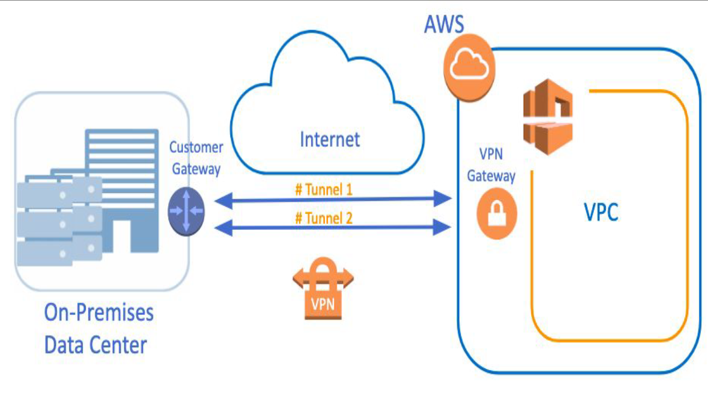

# *VPC ENDPOINT*
- Aws'de S3 ve DynamoDB gibi non VPC servisler mevcut..Aws içinde ama VPCye bağlı olmayan servisler
- Private subnetten internete çıkış nat gateway veya nat ınstance üzerinden sağlayabiliriz. Bu şekilde private subnette bulunan resource nat gatewayy veya nat ınstance kullanarak internet gateway ile inetrnete çıkış sağlayabilir. Bu resource S3 içinden bir bilgiye erişmek istediği zaman inetnert gateway üzerinden tekrar aws içine girmek zorunda..
- AWS bu klasik yöntem yerine **ENDPOINT** ile private subnetteki resource'un ihtiyacını kendi backbone'u içinde olan S3'ten direkt almasını sağlar (internete çıkış yapmadan)..
-           Non VPC alan içinde olan S3 aslında aws içindeki internet gibi düşünülebilir

# *VPC PEERING*
- Farklı VPC'ler arasında iletişim 
- Faklı Vpc'ler içindeki ec2'ların internete çıkış yapmadan (aws içinde) bağlantı sağlanması **VPC PEERING** ile sağlanır
-          Farklı CIDR bloklarındaki ec2'lar arasında ping atılmaz..vpc peering yapılırsa aynı localdeymiş gibi ping atılabilir
-          **VPC1-VPC2 arasında ve VPC1-VPC3 aransında vpc peering olsa bile VPC2-VPC3 arasında ileişim için ayrı vpc peering olmak zorunda**

# *VPN CONNECT*
- AWS Site to Site VPN;
-          On premises data center ile 

