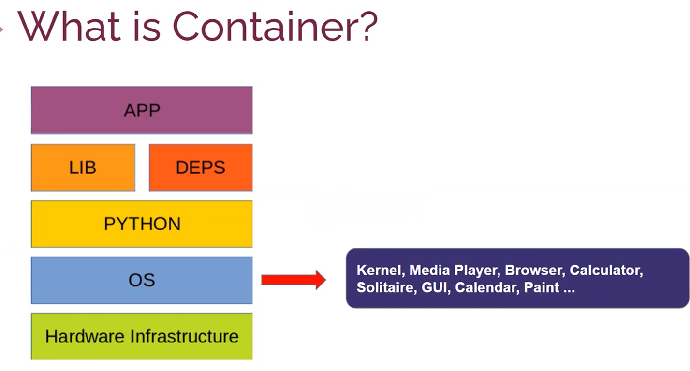
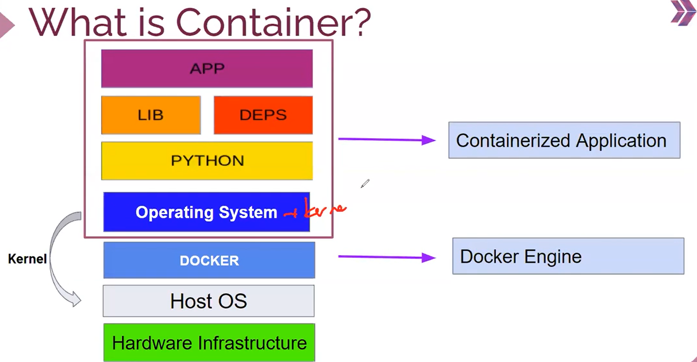
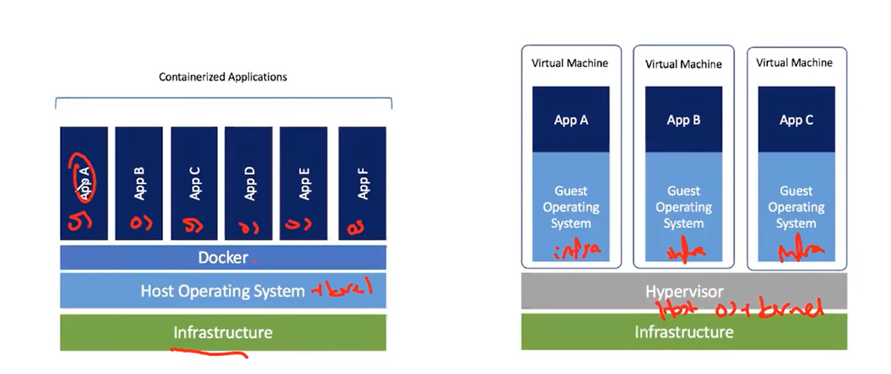
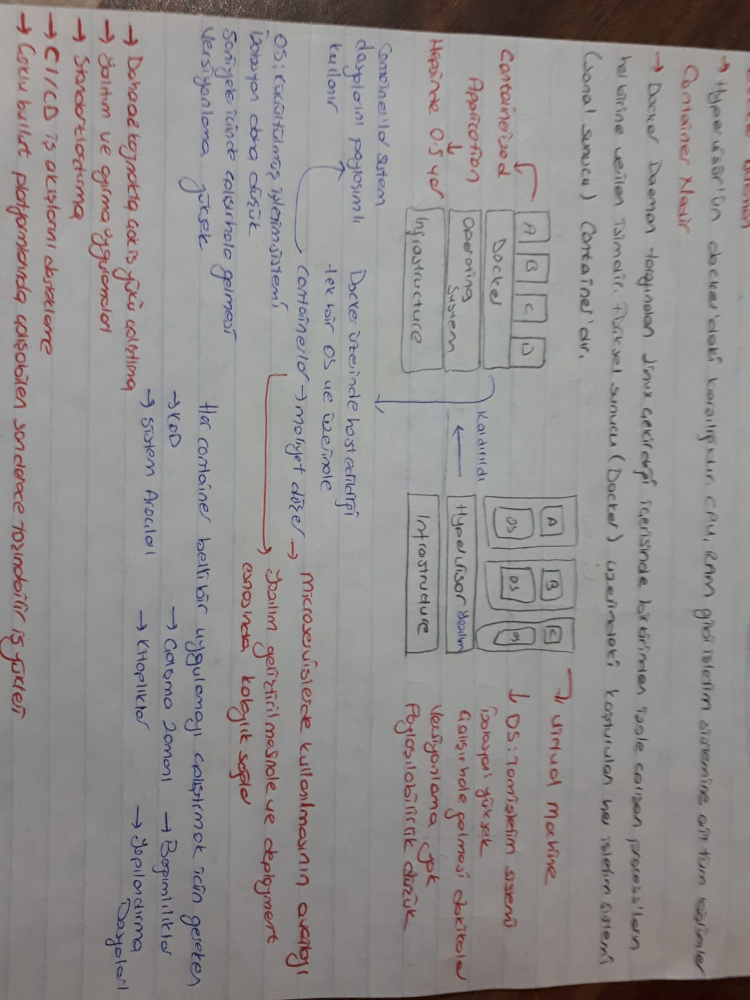

# **DOCKER**
- open source bir container teknolojisi
- DOCKER as a; Company, Product, Platform, CLI Tool, Computer Program 
- aynı işletim sistemi üzerinde birbirinden izole ve bağımsız birçok container sayesinde sanallaşma sağlayan bir teknolojidir
- Container sayısı kaynakla doğru orantılı
- Container'ın ayak izi düşük (resource yani kaynağı daha az kullanır)
- sunucu maliyetlerini azaltmak 

- Host operating system'de kernel, media player vb içerikler mevcut ve bu sistem OS'inin boyutunu büyütür. Bu durum uygulamanın ayakğa kalkmasını yavaşlatır ve daha fazla storage kullanılır 
- Container;
-     Linux çekirdeği içerisinde birbirinden bağımsız çalışan process'ların herbirine verilen isimdir. Fiziksel sunucu (docker) üzerinde koşturulan her işletim sistemi (sanal sunucu) Container'dıır.
- Basit bir flask uygulamasnı çalıştırabilmek için gerekli isterler; OS, python kdou, dependencies, library ve application..Bunların tamamı bir container aslında
- Bu container'ın operating system'inde MİNİMUM isterler var ve kernel yok (boyutunu küçültür)
- Container teknolojisinde kulllanılan en yaygın işletim sistemi **ALPHINE LİNUX** , boyutu 5mb 

- Container sisteminde olmayan Kernel aslında Host OS sistemde (DOCKER ENGINE)
-     Docker Engıne; Docker çekirdeği 

# **CONTAINERS OR VIRTUAL MACHINES**
- Virtual machines için **HYPERVISOR(yazılım)** gerekli ve işlemcinin hypervisor'u desteklemesi gerekir
- HypervisorHOST OS ve KERNEL'dan oluşur 
- Her virtual machine'de infrastructure mevcut 
- Virtual MAchine'in çalışır hale gelmesi daha uzun sürer

- Container'da Host operating system üzerine kurulu bir DOCKER mevcut 
- Hep Application kernel olmadan OS'e sahip 
- Br Container bir app çalıştırır
- App çalışmayı durdurduğu anda container çalışmayı durdurur
- Docker üzerinde host edildiği tek bir OS var ve üzeirnde Container'lar..bu container'lar sistem dosyalarını paylaşımlı kullanır ve maliyet düşürülür
- Container saniyeler içinde çalışır hale gelir

# **DOCKER COMPONENTS**
- Docker Engıne;
-     Docker çekirdeği
- Docker File;
-     Image nasıl oluşturulura ilişkn komut dosyası
- Docker Images;
-     Çalışacak uygulamanızın ve uygulamanızın altyapısında çalışan gerekli işletim sistemi kütüphanelerinin bulunduğu bir yapı
- Docker HUB (Githup gibi)
-     Container ımage'ların deposu 